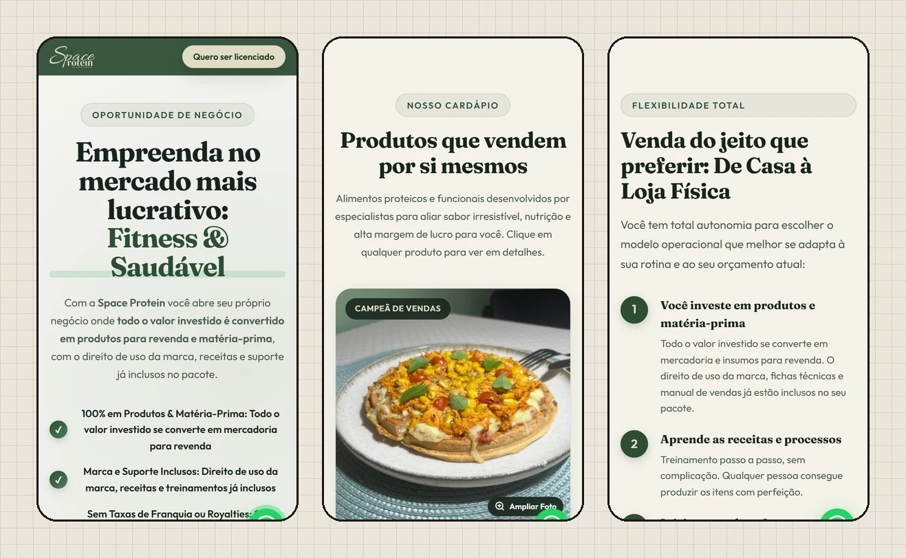
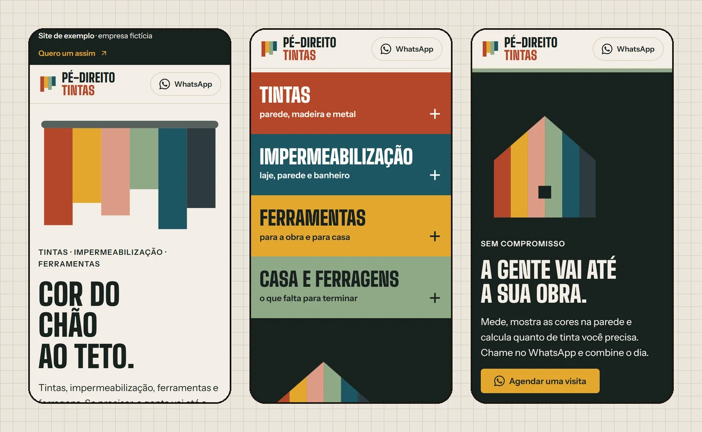
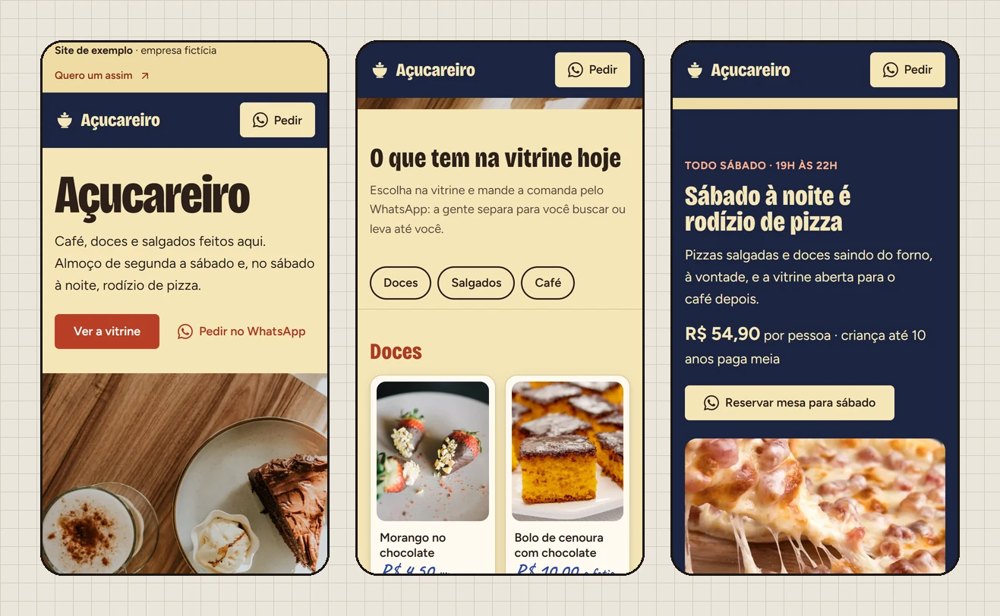
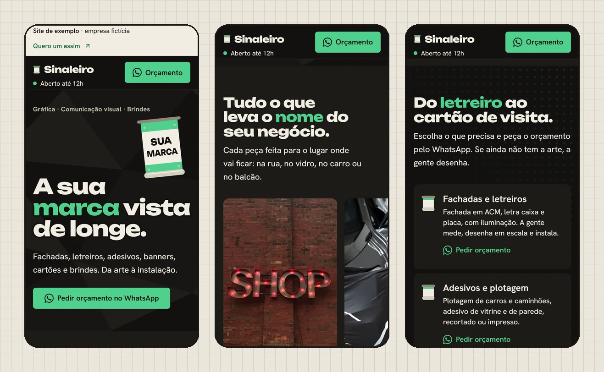

## Rafael Alberto de Araujo

Designer e desenvolvedor web em Capinzal/SC. Desenho e programo sites para negócios de Capinzal e região, com o olhar de quem passou dois anos numa gráfica.

  
  
  
  

Estudo Engenharia da Computação na UNOESC Joaçaba e trabalho como analista de suporte na Wolff Software, com SQL e Firebird no dia a dia.

### Sites

Um no ar, com cliente de verdade, e três exemplos que desenhei e programei para mostrar como fica o site de cada ramo, com empresas inventadas. Os repositórios são privados; toque na imagem para abrir o site.

 

**[Space Protein](https://www.spaceprotein.com.br/)** · alimentação saudável · Balneário Camboriú/SC · `no ar`

Site para quem quer empreender com a marca: mostra o investimento, o que vem incluso e leva direto para a conversa.

 

**[Pé-Direito Tintas](https://projetos-portfolio-araujo.vercel.app/tintas/)** · loja de tintas · `exemplo`

O site é o próprio logo: um rolo desce pintando listras, e cada listra é uma parte da loja.

 

**[Açucareiro](https://projetos-portfolio-araujo.vercel.app/cafeteria/)** · cafeteria · `exemplo`

A casa se apresenta e logo vem a vitrine: cada doce com a etiqueta de preço escrita à mão, e um toque põe o item na comanda.

 

**[Sinaleiro](https://projetos-portfolio-araujo.vercel.app/grafica/)** · gráfica e comunicação visual · `exemplo`

Uma lona com a sua marca se desenrola na primeira tela, e as peças da gráfica aparecem numa vitrine que se rola com o dedo.

### Como os meus sites são feitos

- HTML, CSS e JavaScript, sem framework nem etapa de build
- Desenhados primeiro para a tela do celular
- Política de segurança de conteúdo (CSP) e cabeçalhos de segurança
- Verificação automática de qualidade antes de publicar
- Publicados na Vercel a partir do GitHub

### Ferramentas

  
  
  
  
  
  
  
  
  
  

### Contato

[WhatsApp](https://api.whatsapp.com/send?phone=5549999473789) · [Instagram @araujo.rfa](https://www.instagram.com/araujo.rfa/) · [LinkedIn](https://www.linkedin.com/in/rafaelalbertodearaujo/) · rafaelalbertola02@gmail.com
